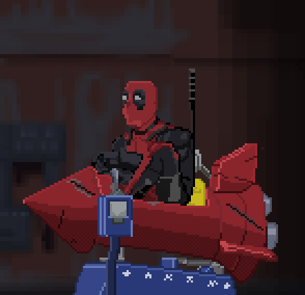

 

##

<!--Sobre mim-->

Meu nome é Beatriz, tenho 17 anos e estudo programação desde os 15. Comecei com interesse em desenvolvimento web por um trabalho escolar e estou focada no estudo de Backend. Pretendo iniciar a faculdade de Análise e Desenvolvimento de Sistemas Ou Sistemas de Informação.

##

<h3 align="left">Contact</h3>

<h3 align="left" color="#8E2939">Skills</h3>

 

##
